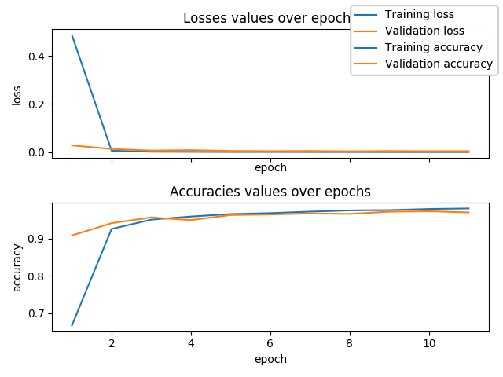

Fully Connected Deep Network for MNIST dataset 
==
* project implemented as part of the *Deep Learning Methods* course attended on MSc degree of *Data Science* at the *Faculty of Mathematics and Information Sciences* in *Warsaw University of Technology*,
* written purely in NumPy library.

Prerequisites
---
* Python 3.6
* Python's `pip`
* `wget`, `gunzip`
* `python3-tkinter` (if you want to plot metrics) 

How to run
---
1. Download datasets to `data/` directory:
    ```bash
    cd data/
    wget http://yann.lecun.com/exdb/mnist/train-images-idx3-ubyte.gz
    wget http://yann.lecun.com/exdb/mnist/train-labels-idx1-ubyte.gz
    wget http://yann.lecun.com/exdb/mnist/t10k-images-idx3-ubyte.gz
    wget http://yann.lecun.com/exdb/mnist/t10k-labels-idx1-ubyte.gz
    ```
2. Unpack datasets in `data/` directory:
    ```bash
    gunzip *
    ``` 
    
3. Install python requirements:
    ```bash
    pip3 install -r requirements.txt
    ```

4. Start training:
    ```bash
    python3 train.py
    ```

Results
---
Results obtained so far with *Weight decay* and *Adam optimizer*:
```
2019-03-18 02:21:44,833 - MNIST_FCDN_NumPy - INFO - epoch 43 - training loss 0.000000 - training accuracy 0.995783
2019-03-18 02:21:46,699 - MNIST_FCDN_NumPy - INFO - epoch 43 - validation loss 0.005396 - validation accuracy 0.978100
```

Sample plot drawn by this application looks like this:



Remarks
---
* as stated on [Yann Lecun's MNIST page](http://yann.lecun.com/exdb/mnist/), the best result for _Neural Nets_ is *0.35* error rate (in %). So far, the model presented in this repository achieves *2.2* error rate. Possibly, increasing model capacity 
with enabled _dropout_ mechanism might result in decreasing error rate,
* `train.py` script accepts a lot of arguments. Read more by executing `train.py -h` in console.

TODO
---
* implement *Dropout* mechanism