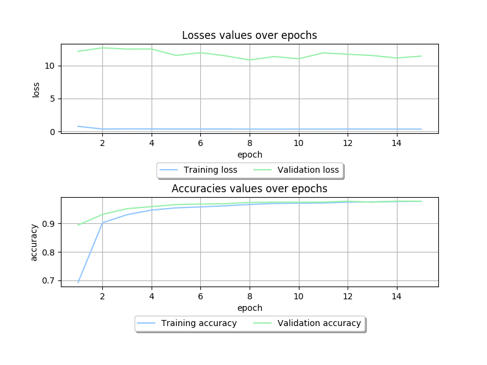
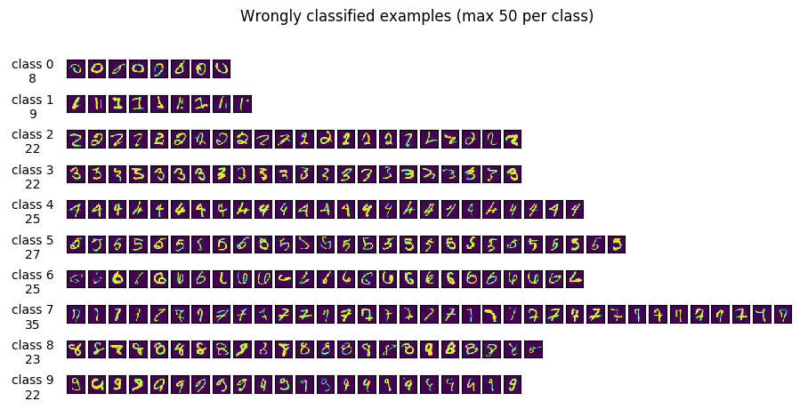
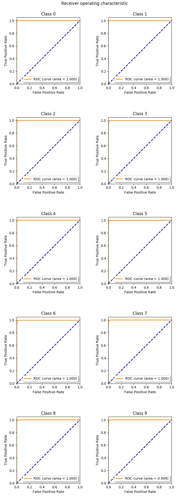

Fully Connected Deep Network for MNIST dataset 
==
* project implemented as part of the *Deep Learning Methods* course attended on MSc degree of *Data Science* at the *Faculty of Mathematics and Information Sciences* in *Warsaw University of Technology*,
* written purely in NumPy (`numpy` branch) and CuPy (`master` branch) libraries.

Prerequisites
---
* Python 3.6
* Python's `pip`
* `wget`, `gunzip`
* `python3-tkinter` (if you want to plot metrics)
* `cuda` (if version with `cupy` will be used)

How to run via CLI
---
1. Download datasets to `data/` directory:
    ```bash
    cd data/
    wget http://yann.lecun.com/exdb/mnist/train-images-idx3-ubyte.gz
    wget http://yann.lecun.com/exdb/mnist/train-labels-idx1-ubyte.gz
    wget http://yann.lecun.com/exdb/mnist/t10k-images-idx3-ubyte.gz
    wget http://yann.lecun.com/exdb/mnist/t10k-labels-idx1-ubyte.gz
    ```
2. Unpack datasets in `data/` directory:
    ```bash
    gunzip *
    ``` 
    
3. Install python requirements:
    ```bash
    pip3 install -r requirements.txt 
    ```
    
4. Install system requirements:
    ```bash
    sudo apt install python3-tk
    ```

5. Start training:
    ```bash
    python3 run.py
    ```

How to run via Google Colab
---
1. Open `google_colab.ipynb` in Google Colab by clicking [this](http://colab.research.google.com/github/VictorAtPL/MNIST_FCDN_NumPy/blob/master/google_colab.ipynb) link,
2. run all cells.

Results
---
Results obtained so far with *Weight decay*, *Adam optimizer* and *Dropout*:
```
2019-03-26 00:18:41,382 - MNIST_FCDN_NumPy - INFO - epoch 14 - training loss 0.381925 - training accuracy 0.977683
2019-03-26 00:18:42,486 - MNIST_FCDN_NumPy - INFO - epoch 14 - validation loss 11.725633 - validation accuracy 0.978400
2019-03-26 00:18:42,488 - MNIST_FCDN_NumPy - INFO - epoch 14 - time taken 1.79
```

Sample plots drawn by this application looks like this:







Remarks
---
* as stated on [Yann Lecun's MNIST page](http://yann.lecun.com/exdb/mnist/), the best result for _Neural Nets_ is *0.35* error rate (in %). The model presented in this repository achieves *1.5* error rate. Possibly, adding data augmentation and/or using conv nets might result in further decreasing error rate,
* `run.py` script accepts a lot of arguments. Read more by executing `train.py -h` in console.